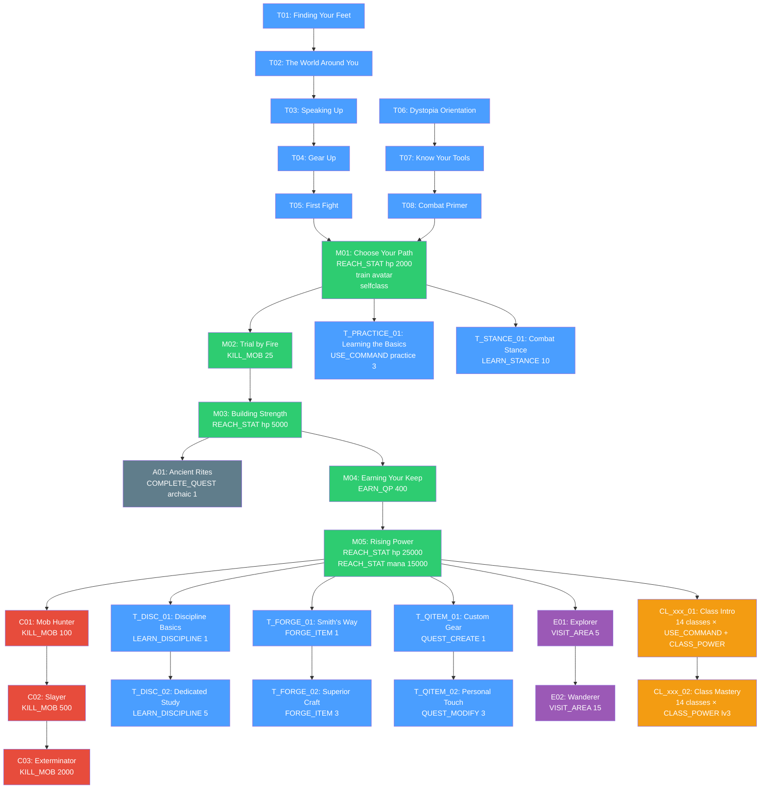
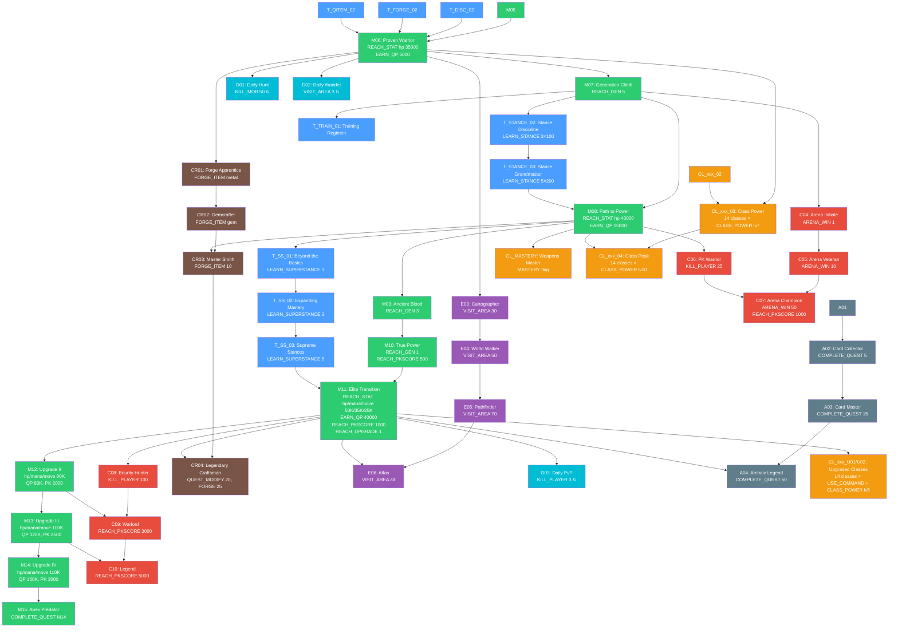

# Player Progression Journey Map

Complete quest dependency graph, story node integration, and class branching for the Dystopia MUD verification system.

## Phase Overview

| Phase | Name | Quests | Gate Quest | Key Objective Types | Story Nodes |
|-------|------|--------|------------|---------------------|-------------|
| 0 | Tutorial | T01-T08 (8) | explevel gating | USE_COMMAND, KILL_MOB | — |
| 1 | Foundation | M01-M04, T_PRACTICE_01, T_STANCE_01, A01 (7) | T05 or T08 → M01 | REACH_STAT, EARN_QP, LEARN_STANCE | 1-2 |
| 2 | Growth | M05, C01-C03, T_DISC/FORGE/QITEM, E01-E02, CL_xxx_01/02 (41) | M04 → M05 | LEARN_DISCIPLINE, FORGE_ITEM, QUEST_CREATE, CLASS_POWER, VISIT_AREA | 3-8 |
| 3 | Power | M06-M07, C04-C05, T_STANCE_02/03, T_TRAIN_01, CR01-CR02, E03-E04, D01-D02, A02, CL_xxx_03 (27) | M05 + system tutorials → M06 | ARENA_WIN, REACH_GEN, LEARN_STANCE (mastery) | 9-12 |
| 4 | Ascension | M08-M11, T_SS_01-03, C06-C07, CR03, CL_MASTERY, E05, A03, CL_xxx_04 (26) | M07 + T_STANCE_03 → M08 | LEARN_SUPERSTANCE, REACH_UPGRADE, KILL_PLAYER, REACH_PKSCORE | 13-15 |
| 5 | Transcendence | M12-M15, C08-C10, CR04, E06, D03, A04, CL_xxx_U01/U02 (32) | M11 → M12 | REACH_UPGRADE (2-4), massive stat/QP gates | 16 |

**Total: 141 quest definitions**

---

## Quest Dependency Graph: Phases 0-2



## Quest Dependency Graph: Phases 3-5



---

## FTUE Branching

Three experience levels converge at M01 via OR-logic prerequisites:

```
explevel 0 (Never played a MUD):  T01 → T02 → T03 → T04 → T05 ─┐
                                                                   ├──→ M01
explevel 1 (MUD veteran, new to Dystopia):  T06 → T07 → T08 ─────┘
                                                                   │
explevel 2+ (Dystopia veteran):  ──────────────────────────────────┘
                                 (M01 auto-available, T quests FTUE-skipped)
```

- `min_explevel` / `max_explevel` on each tutorial quest controls visibility
- FTUE-skipped quests (QFLAG_FTUE_SKIP) auto-satisfy as prerequisites for downstream quests
- Bot `--explevel` flag maps: CLI 1 → server explevel 0, CLI 2 → server 1, CLI 3 → server 2

---

## Class Branching

### 14 Base Classes (Phase 2-4)

Each base class has a 4-quest chain gated by `required_class`:

| Prefix | Class | Phase 2 (_01, _02) | Phase 3 (_03) | Phase 4 (_04) | Progression Type |
|--------|-------|-------------------|---------------|---------------|------------------|
| CL_VAMP | Vampire | Claws/fangs → Protean 3 | Protean 7 + Obtenebration 5 | Protean 10 + Presence 7 | Discipline (disc: protean) |
| CL_WW | Werewolf | Rage/transform → Gifts 3 | Gifts 7 | Gifts 10 + Luna 5 | Discipline (disc: bear) |
| CL_DEM | Demon | Horns/wings → Attack 3 | Attack 7 + Hellfire 5 | Attack 10 + Temptation 7 | Discipline (disc: attack) |
| CL_MNK | Monk | Chi/meditate → Martial 3 | Martial 7 + Weapon 150 | Martial 10 + all wpn 200 | Discipline |
| CL_MAG | Mage | Cast/spell 50 → Spell 100 | All spells 150 + Arcane 7 | All spells 200 + Arcane 10 | Discipline (disc: arcane) |
| CL_NIN | Ninja | Vanish/backstab → Shadow 3 | Shadow 7 | Shadow 10 | Discipline |
| CL_DRW | Drow | Web/shadowplane → Spider 3 | Spider 7 | Spider 10 | Discipline |
| CL_DGS | Dirgesinger | Sing → Song 3 | Song 7 | Song 10 | Train cmd: songtrain |
| CL_PSI | Psion | Focus → Psionic 3 | Psionic 7 | Psionic 10 | Train cmd: psitrain |
| CL_DKN | Dragonkin | Breathe → Dragon 3 | Dragon 7 | Dragon 10 | Train cmd: dragontrain |
| CL_ART | Artificer | Turret/blaster → Tech 3 | Tech 7 | Tech 10 | Train cmd: techtrain |
| CL_CLT | Cultist | Ritual → Void 3 | Void 7 | Void 10 | Train cmd: voidtrain |
| CL_CHR | Chronomancer | Flux/quicken → Time 3 | Time 7 | Time 10 | Train cmd: timetrain |
| CL_SHM | Shaman | Commune → Spirit 3 | Spirit 7 | Spirit 10 | Train cmd: spirittrain |

### 14 Upgraded Classes (Phase 5)

Each upgraded class has a 2-quest chain, unlocked after M11:

| Prefix | Class | Upgrades From | _U01 | _U02 | Train cmd |
|--------|-------|---------------|------|------|-----------|
| CL_TAN | Tanarri | Demon | demonform | Tanarri power 5 | — |
| CL_DRD | Spider Droid | Ninja? | power | Droid power 5 | — |
| CL_SAM | Samurai | Monk? | koryou | Weapon 500 + Bushido 5 | — |
| CL_UDK | Undead Knight | — | darkheart | Death power 5 | — |
| CL_ANG | Angel | — | spiritform/halo | Angelic power 5 | — |
| CL_SHP | Shapeshifter | — | morph | Morphosis 5 | — |
| CL_LCH | Lich | Mage? | lichform | Necromancy 5 | — |
| CL_SRN | Siren | Dirgesinger | voicetrain | Voice 5 | voicetrain |
| CL_MFL | Mindflayer | Psion | mindtrain | Mind 5 | mindtrain |
| CL_WYR | Wyrm | Dragonkin | wyrmtrain | Wyrm 5 | wyrmtrain |
| CL_MCH | Mechanist | Artificer | cybtrain | Cyber 5 | cybtrain |
| CL_VBN | Voidborn | Cultist | voidform | Voidborn 5 | — |
| CL_PAR | Paradox | Chronomancer | paratrain | Paradox 5 | paratrain |
| CL_SPL | Spirit Lord | Shaman | lordtrain | Lordship 5 | lordtrain |

---

## Story Node Map: "Echoes of the Sundering"

16-node narrative progression tracked via `story_node`, `story_kills`, and `story_progress` bitfield.

| Node | Area | Hub NPC (vnum) | Hub Type | Kill | Fetch | Examine | Talk NPC | Intro Keyword |
|------|------|---------------|----------|------|-------|---------|----------|---------------|
| 1 | Midgaard | Executioner (3011) | talk | — | — | — | — | "darkness" |
| 2 | Graveyard | Henry (3600) | full | 3 undead | bone (3699 @ 3607) | tomb (3650) | — | "darkness" |
| 3 | Chapel | Priest (3405) | full | 1 wraith | scroll (3498 @ 3457) | etchings (3465) | — | "marks" |
| 4 | Grove | Hierophant (8900) | light | 2 corrupted | — | roots (8905) | — | "sundering" |
| 5 | Canyon | Earth Ruler (9208) | light | 3 elementals | — | throne (9227) | — | "sundering" |
| 6 | Moria | The Mage (4100) | full | 5 tunnel mobs | slime mold (4103 @ 4118) | carvings (4160) | — | "carvings" |
| 7 | Hitower | Adventurer (1301) | full | 3 golems | journal (1499 @ 1367) | mirror (1336) | — | "sorcerer" |
| 8 | Thalos | Librarian (5315) | full | 2 beasts | — | statue (5386), foundation (5371) | — | "thalos" |
| 9 | Drow City | Priestess (5104) | light | — | — | altar (5145) | — | "displacement" |
| 10 | Pyramid | Sphinx (2616) | full | — | tablet (2699 @ 2630) | hieroglyphics (2629) | — | "cycle" |
| 11 | Dreamscape | Keeper (8600) | light | — | — | church (8637) | — | "between" |
| 12 | Atlantis | Neptune (8103) | light | 1 guard | — | murals (8131) | — | "convergence" |
| 13 | Mega-City | Judge (8010) | light | 1 punk | — | rubble (8014) | — | "future" |
| 14 | Domeship | Elfangor (93006) | light | — | — | sensors (93045) | — | "origin" |
| 15 | Dystopia | Queen (30508) | full | 1 guard | — | records (30460) | King (30509): "unraveling" | "old city" |
| 16 | Heaven | Overseer (99004) | talk | — | — | — | — | "what now" |

**Node 12 alternate**: Olympus path — Zeus (901), kill chimera (920), examine scorch (910). Bot defaults to Atlantis.

### Task Bits

Each node's progress is tracked by a bitfield in `story_progress`:
- `0x01` — Kill task (or first examine-only task)
- `0x02` — Fetch task (or second examine task)
- `0x04` — Examine/talk NPC task (third task on full hubs)

Return keyword "done" advances to next node after all required bits are set.

---

## Story ↔ Quest Synergy

Story progression naturally fulfills or advances these quest objective types:

| Quest Objective | How Story Helps | Example Quests |
|-----------------|-----------------|----------------|
| VISIT_AREA | 16 unique areas traversed | E01 (5 areas), E02 (15), E03 (30) |
| KILL_MOB | Kill tasks in nodes 2-8, 12-13, 15 | M02 (25 kills), C01 (100), C02 (500) |
| WEAPON_SKILL | Multi-round combat in tough story areas trains skills | CL_MNK_03, CL_MAG_03 |
| SPELL_SKILL | Same: multi-round combat trains spell proficiency | CL_MAG_02 (spell 100), CL_MAG_03 (spell 150) |
| LEARN_STANCE | Multi-round fights train stance skill | T_STANCE_01 (skill 10), T_STANCE_02 (3×100) |
| LEARN_DISCIPLINE | Kills during story grant discipline XP (research active) | T_DISC_01, T_DISC_02, CL_DEM_02 |

**Key insight**: Running story progression while questing creates a positive feedback loop — story kills feed quest objectives, and quest rewards (QP, XP) enable stat training for later story nodes.
