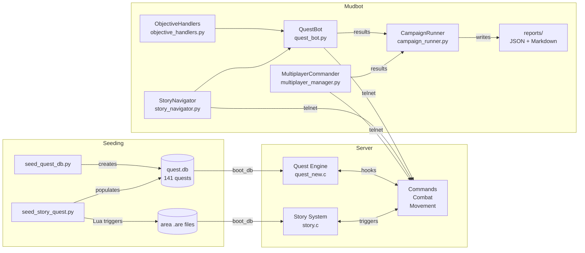

# Bot-Driven Quest & Story Verification System

Mudbot's verification system uses automated bots to validate that Dystopia MUD's 141-quest progression tree, 16-node story narrative, and multiplayer interactions work correctly end-to-end. Bots connect via telnet, drive player commands, parse server output, and generate coverage reports — replacing manual playtesting with repeatable, evidence-based verification.

## Architecture



## Quick Start

**Single quest bot** (one character, quest progression):
```bash
python -m mudbot quest --name TestBot --password secret123 --explevel 1 --mode all --enable-story
```

**Full campaign** (class × explevel matrix, coverage report):
```bash
python -m mudbot campaign --password testpass --prefix Camp --classes demon --explevels 1,3 --output-dir game/tools/mudbot/reports
```

**Multiplayer scenarios** (coordinated multi-bot):
```bash
python -m mudbot multiplayer --count 2 --prefix Team --password testpass --scenario follow_group_tutorial
```

## Current Coverage

| Metric | Covered | Total | % |
|--------|---------|-------|---|
| Quest definitions | 7 | 141 | 5.0% |
| Story nodes | 0 | 16 | 0% |
| Multiplayer scenarios | 0 | 3 | 0% |
| Objective types handled | 20 | 24 | 83% |

*Last updated: 2026-03-13 (campaign run explevel=3, demon class)*

Best single-bot run completed: T01, T02, T03, T04, T05, M01, T_PRACTICE_01.

## Document Index

| Document | Purpose |
|----------|---------|
| [journey_map.md](journey_map.md) | Full 141-quest dependency graph, FTUE branching, 28-class branching, 16-node story map, story↔quest synergy |
| [coverage_matrix.md](coverage_matrix.md) | Quest-by-quest verification status, per-phase contracts, story contracts, multiplayer contracts |
| [bot_capability_inventory.md](bot_capability_inventory.md) | 24 objective type support matrix, failure taxonomy, class command mapping, parser inventory |
| [roadmap.md](roadmap.md) | Prioritized path from 5% to 100% coverage with 9 work items |

## Key Source Files

| File | Role |
|------|------|
| `game/tools/seeders/seed_quest_db.py` | Canonical quest definitions (141 quests, 24 objective types) |
| `game/tools/mudbot/utils/story_data.py` | 16 story nodes + 28 class command mappings |
| `game/src/systems/quest_new.c` | Server quest engine (hooks, milestones, state transitions) |
| `game/src/db/db_quest.h` | Quest data structures and objective type constants |
| `game/src/systems/story.c` | Server story system (16 nodes, clue lookup) |
| `game/tools/mudbot/bot/quest_bot.py` | Quest bot state machine (13 states) |
| `game/tools/mudbot/bot/objective_handlers.py` | Advanced objective dispatch |
| `game/tools/mudbot/commander/campaign_runner.py` | Campaign orchestration + report generation |

## Supersedes

- `architecture.md` — Framework design content is now in this document and [bot_capability_inventory.md](bot_capability_inventory.md)
- `quest_story_test_campaign.md` — Campaign strategy is now in [coverage_matrix.md](coverage_matrix.md) and [roadmap.md](roadmap.md)
